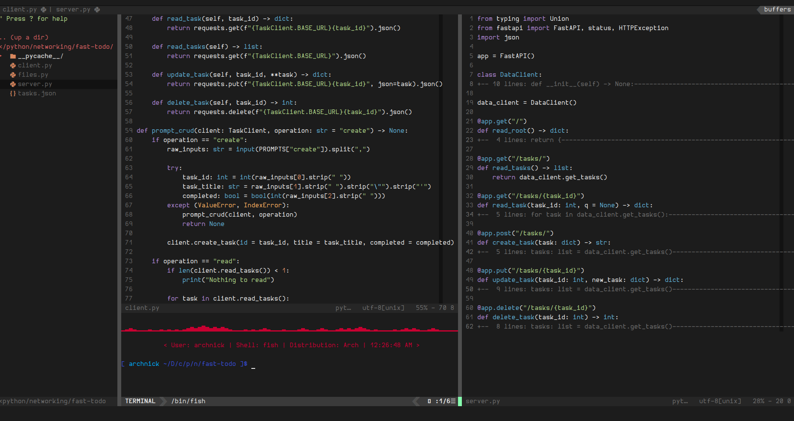

# dotfiles
### Configuration files written by me.

<br>

## Hyprland

This is my daily driver. I found waybar configuration on r/unixporn and modified it.
For waybar icons make sure you have `otf-hermit-nerd` installed:

```shell
$ sudo pacman -S otf-hermit-nerd
```

<br>

## Vim


<br>

## Tmux

original: https://github.com/gpakosz/.tmux

<br>

## GIMP

I didnt write this one but I really like it. [Diolinux/PhotoGIMP](https://github.com/Diolinux/PhotoGIMP/tree/master/.var/app/org.gimp.GIMP/config/GIMP/2.10)
