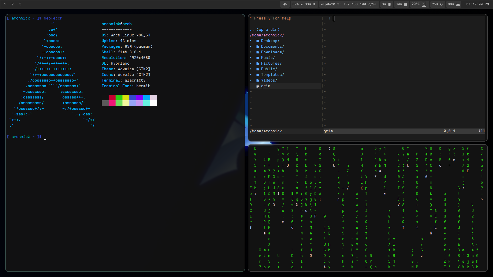
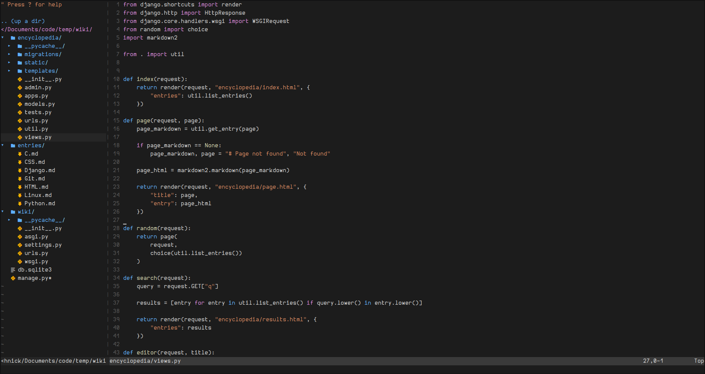
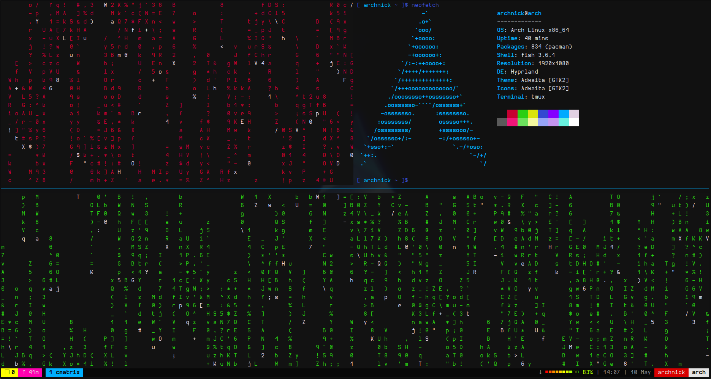
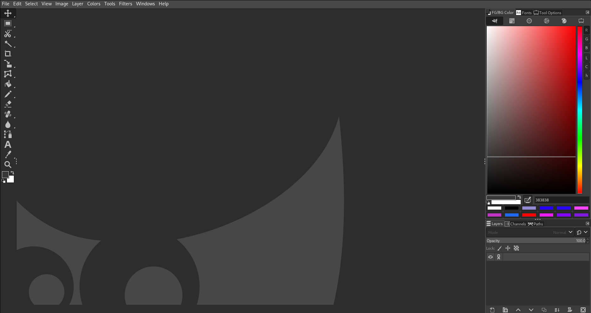

# dotfiles
### configuration files written by me.

 

## Hyprland

I am trying to escape GNOME...

 

## Vim

I have vim plugins in my .vim directory I didnt upload the .vim directory becuase I didnt want to add someone else's repos in my dotfiles. You can get the plugins yourself:

- vim-code-dark
- AutoComplPop
- nerdtree
- vim-devicons
- vim-eclim
- vim-nerdtree-syntax-highlight
- vim-visual-multi

 

## Tmux

original: https://github.com/gpakosz/.tmux

 

## GIMP

I didnt write this one but I really like it. :)